# Image Halftone Experiment

Генерирует SVG халфтоновый эффект из изображения с анимацией мерцания точек.

Например:



## Что делает

Скрипт преобразует любое изображение в компактный SVG с:
- **Халфтоновым растром** — изображение из точек разного размера (как на плакате)
- **CSS-анимацией** — каждая точка пульсирует с уникальной задержкой
- **Прозрачным фоном** — работает на любом фоне (темная/светлая тема)
- **Минимальным размером** — оптимизирован через переиспользование CSS-классов

## Быстрый старт

```bash
# Установить зависимости
poetry install

# Запустить
poetry run python main.py img/img_2.jpg
```

На выходе получишь `img_2j.svg` с анимацией.

## Параметры

В коде (строка 53) можно менять:
- `cols=90` — кол-во колонок (больше = детальнее, но тяжелее)
- `max_radius=5` — макс размер точки

Параметры анимации в функции `generate_halftone_svg()`:
- `animation_variants=12` — кол-во групп точек с разными задержками (чем меньше --> компактнее SVG)

В стилях CSS можно поиграться:
- `animation-duration: 1.5s` — скорость пульсации (чем меньше --> быстрее)
- `animation-delay: calc(var(--i) * 0.1s)` — задержка для каждой точки (чем меньше --> быстрее)
- `animation-iteration-count: infinite` — бесконечная анимация (можно убрать, если нужно один раз)
- `transform:scale(0.99)` — масштабирование групп точек (можно экстремально всю картинку "схлопнуть"
  или наоборот ""распустить")
- `fill:#80000090` -- цвет точек (с прозрачностью)
